# Handson for the Conclusion Code Café on Easy web development with Vue 3

These are the suggestions for getting going quickly with an easy introduction to web development with Vue 3. This handson will guide you through the essential elements of Vue applications and allows you to get going rapidly.

The main topics you will work on:
* components
* html and script 
* nested components
* style
* reactive
* developing a Vue application 
* state (reactive session data shared across components)
* UI Component libraries
* i18n

Useful resources:
* [Vue 3 Documentation](https://vuejs.org/guide/essentials/application.html)
* [Vue 3 Playground](https://play.vuejs.org/)

- [Handson for the Conclusion Code Café on Easy web development with Vue 3](#handson-for-the-conclusion-code-café-on-easy-web-development-with-vue-3)
  - [Vue Components](#vue-components)
    - [Child Component](#child-component)
    - [Expressions, Script and Vue Attributes](#expressions-script-and-vue-attributes)
    - [Interaction with Nested Components](#interaction-with-nested-components)
      - [Properties](#properties)
      - [Events](#events)
      - [Slots](#slots)
  - [Reactive](#reactive)
    - [First simple steps with Reactive, Computed and Watch](#first-simple-steps-with-reactive-computed-and-watch)
    - [Reactive Example - Clock Adjustment](#reactive-example---clock-adjustment)
  - [Software Engineering](#software-engineering)
    - [Vue Development with Stack Blitz](#vue-development-with-stack-blitz)
  - [State (optional)](#state-optional)
  - [UI Libraries](#ui-libraries)
  - [i18n - internationalization](#i18n---internationalization)


## Vue Components

Before looking at applications in their entirety, we will look at the components that make up an application. A component can contain three things: 
* `template` - a mix of HTML and Vue tags and attributes, including JavaScript expressions
* `script` - JavaScript (or TypeScript) providing logic for the component and to import Vue components and other resources
* `style` - CSS style definitions intended for the HTML elements rendered by the component and

Open [this Vue Playground](https://play.vuejs.org/#eNp9kctOwzAQRX9l5HXVCGVXRZF4VAIWgKBLb9xkmrj4JT9Kpar/ztihgQXqzrnnTHwnObFb55aHhGzFmojaKRGx5QagGW/azYhAXMlORGlNU1FWWC8P5ZC1un3AKKQKhOtL6tpH9AidTaqHLYIAk/QWPdgd7KzXgAo1mhgW0wCA1GLAAML0YONIpqNneoGJpDWVmy6uppubau7KFiwG0nZyWO6DNbTIKaucdVY7qdC/ulw+cLaCQjITStmv55JFn/CnBc2M2H3+k+/DMWecvXkM6A/I2cyi8APGCa8/XvBI5xlq2ydF9hX4jsGqlDtO2l0yPdX+45W2T9pZH6UZNmF9pI8SLkvlotk8F58z+pv3V1b/rVsv6zLHzZmdvwGbtqkv) with a minimal application. 

On the left you see the source of the heart of the application, on the right you will find the result of running the application. 

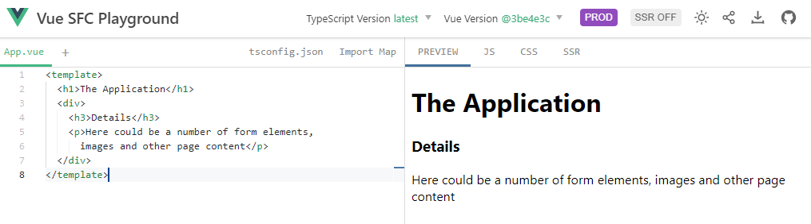

The `template` fragment of a Vue component also can contain JavaScript expressions. For example, add this next section under the `<h1>` element in the App.vue component:

`<h3>Current Time {{new Date()}}</h3>`

This should result in the current date time being displayed under the page's main header. The `{{expression}}` or moustache-expression is how you can include an expression to be evaluated to a string to be rendered anywhere there can be plain content. Expresions can also be used to provide values for attributes for HTML (and Vue) tags, as you will see in a moment. 

Add the following snippet below the `<template>`:

``` 
<script setup> 
   const today = `Tuesday`
</script>
```

This adds our first piece of JavaScript to the component. It is rather simple and does nothing more than define a JavaScript constant called `today`.

We can refer to this JavaScript variable - even though it is a const, we still refer to it as a variable - in expressions in the `<template>`. 

Replace the `<h3>` tag you added earlier with the following:
``` 
<h3>Today is {{today}}</h3>
``` 

Of course if you set *today* to a different value, the result of rendering the component will reflect that different value.

``` 
<h3>Today is {{today}}</h3>
``` 

Expressions can contain JavaScript logic; you can for example change the expression `{{today}}` into `today.toUpperCase()`. 

Before you continue, remove the `h3` element.

### Child Component

One key characteristic of Vue - as well as HTML and any other web development framework - is the way components are created and assembled together into larger comoponents and full blown pages and applications. So far you have worked on a single component - App.vue - that contains HTML *components* that can be understood and rendered by the browser. 

Let's add a tag that the browser can not just understand. Replace the `<p>` tag with:
```
  <MyComponent></MyComponent>
```

This will not result in any content being rendered. The browser - nor the Vue transpiler - do not understand *MyComponent*. Let's help them out.

Click on the + icon, right next to the *App.vue* label:
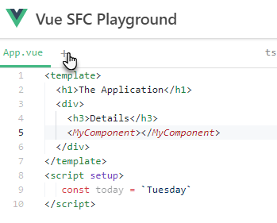

Change the proposed name `Comp.vue` into `MyComponent.vue`.

Add the following to the new component:
``` 
<template>
    <p>Here could be a number of form elements,
        images and other page content</p>
</template> 
```

You will notice that the application as rendered on the right hand side of the web page does not show yet this content.

Before the tag `MyComponent` can be interpreted in the context of *App.vue*, we have to make the component known, in an explicit way using the `import` statement.

Under the `<script setup>` tag, add this line:
```
   import MyComponent from "./MyComponent.vue" 
```

As soon as this is included, the tag `MyComponent` in *App.vue* starts to make sense. Where that tag is used, the definition in file *MyComponent.vue* is included and interpreted.

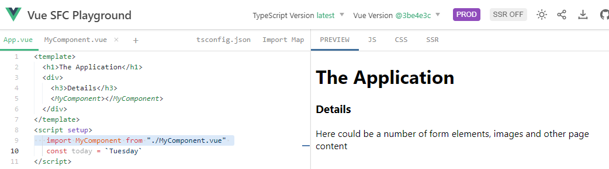

Add the following below the occurrence of `MyComponent` in *App.vue*:

```
    <MyComponent></MyComponent>
    <h3>One More</h3>
    <MyComponent/>
```

Not because it makes so much sense contentwise but to get a feel for how the tag `MyComponent`, representing the custom component MyComponent can be used and reused.

### Expressions, Script and Vue Attributes

Vue introduces several predefined attributes that can be added to HTML or custom tags. These are used for example for conditional rendering (v-if, v-else-if, v-else) and for list rendering (v-for). 

Let's try the list rendering first. Replace

```
    <h3>One More</h3>
    <MyComponent/>
```

with

```
    <h3>Four More</h3>
    <MyComponent v-for="i in 4"/>
```
The `v-for` will loop four times and render *MyComponent* in each iteration. Note that `v-for` can also loop over arrays and objects. For example:

```
    <p v-for="color in ['red','green','blue']">
      <p>{{color}}</p>
    </p>
```

Add this to the `<template>` and you will see three colors displayed - well, their names that is. To add little color for real, add the following the style attribute to the inner `<p>` :  ``:style="`background-color:${color}`"``

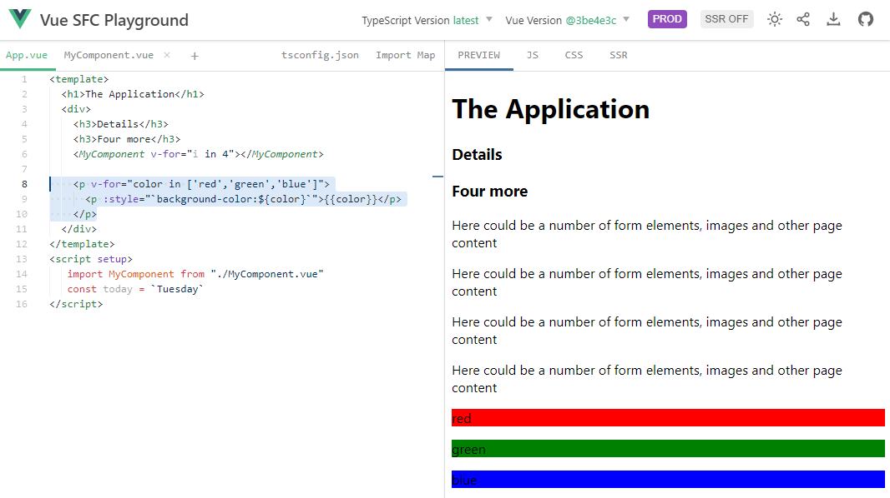

You may wonder: what happened here all of a sudden? What is attribute *:style* and what is that expression like value for that weird attribute doing?

I have mentioned before that in addition to using *{{}}* expressions inside *template* in all the places where content can be rendered, we can also use expressions when providing the values of attributes. These expressions can be simple JavaScript calculations or String manipulations, they can refer to variable defined in the *script* section of a component or to temporary variables created by *v-for*. To indicate that the value of an attribute is to be interpreted as an expression, we prefix the attribute with a colon, hence the *:style*. A normal value for *style* would be something like `background-color:red`. To make this into a dynamic expression, we create a String using the backticks: ``background-color:red`` and then we replace the hardcoded color *red* with dynamic reference `${color}` that is evaluated to whatever value the variable *color* is holding - red, green or blue.


The attribute `v-if` is used to control whether an element is rendered at all. For example, add `v-if="false"` to the `<h3>` element that proclaims *four more*:

```
<h3 v-if="false">Four more</h3>
```
The *h3* is not rendered now. 

Add this *const* definition in the *script* section:

``` 
const toggle = false
```

Change `v-if="false"` to `v-if="toggle"`. The header is still not rendered, this time controlled by the JavaScript *toggle*. Add `v-if="toggle"` to the *MyComponent* tag with the *v-for* attribute. 

The four instances of *MyComponent* are no longer rendered.

Add a new element right below the *MyComponent* tag with the *v-for* attribute.
```
<h3 v-else>Not Four more</h3>
```

The *v-else* is associated with the immediately preceding *v-if*. The *h3* tag with this attribute is only rendered if the tag with the preceding *v-if* is not.

In the *script* section, change the value of *toggle* from `false` to `true`. You will see some content reappearing, and some disappearing.

Vue makes it easy to handle user activity. The easiest example is a click on a button. 

Add a button - as the last element in the *template*:

```
<button @click="console.log('Button was clicked ')">Click Me Please</button>
```
The button appears in the web page. You can click it, as you are kindly invited to do. To see the effect of your click, you need to open the Developer Tools in your browser. Depending on the browser and your operating system, you may require a different key combination. For me it is *Ctrl+Shift+I*. Inside Developer Tools, open the *Console*. You will see the tell tale sign that the button was indeed clicked.

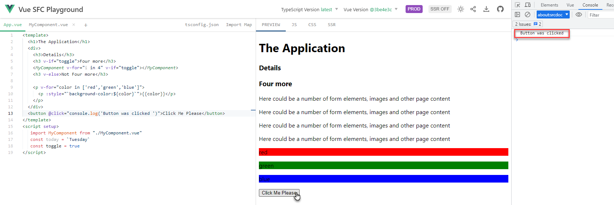

### Interaction with Nested Components

A component can be completely independent - not interact at all with the context in which it is used. Do its own thing, render its own content. However, frequently a component can be configured for the context in which it is used. There are three ways we will discuss in which to configure a component for the context:

* properties - values passed in by the parent component that the component uses like locally defined variables
* slots - content fragments injected by the parent component and positioned in the right locations within the component
* events - messages published by the component to inform the parent component about relevant proceedings

Open this [Vue Playground Example](https://play.vuejs.org/#eNqNVFFP2zAQ/iunTJMGok0BlYesoA3GJPawocFjXtzk0hhc27Kdtgzx33d2Wict0O0hkuPvs++77+78nHzVerhoMMmSiS0M1w4sukZf5JLPtTIO7mu8bJxTEiqj5pAnwzRu+ZN5kstcTtL2NJ2jH4dzLZhD+gOY1McX33CupHWGOU4XqQokWoclFIqCSJTOTlKitXQDaVitw14yk0FAYtyLSachUJks91MmadSUHCXOFkpWfDZ8sEpS6s/+bJ54NVyg+aW9TJsnGQTEY0wItfwR9pxp8GizX9RYPL6x/2BXfi9Pbg1aNAvyKWKOmRm6Fr6++4krWkdwrspGEHsP+ButEo3X2NIuG1mS7B4vqL0JBeRydm+vVw6l3STlhXrmS+DnCVXxak/qndzT4Wk4l8sXcnGrDV43kKFWoI+ctg5qqpDAK8GLRziHT7igmh/A+QVFIc7Lhty1kf/p2oj+vJaJhkIwa89JlFLCcZ0nEQyEadszXwofiWi9uJ8OiBxWk7SlbR+1msnd612wvz0FdK+rEdqzpJT4nbK0zbjXZ+HXuifRLtNDuG8vpa6XjnGJBg5TDw3X0Voz/HVaWe4LkYFBuowv8PMGKrml+58y4FLQHYOpUMVjRKfKlGgGU0Ua5xkc6xWUtKZRmwrW45GamwqeVANLJp3nWKAuIkk+xVot0LCpQPAGrFXGIvUy6cExic0iYDGjBbd8ygV3pLzmZYkyalny0tWk9WSkV10ipHZmFGkaFEooegI+jMfjCG/2qqqKez7ggAk+I9sK6i80EdKsLGkQMhiTIaNdtwwreWMzOFvH75l0uy5EsGWTYS/r7WKxaRjMrlh/BpxMXVFyvZjr0pyMP8ZNgZUjcaNuZ05Dx+WgBQZnG2t60r6zEqkJoqpOkNKsCEZ3mdLTS/PfqlzDMBqe2kB4q7LMGLXcV9osYxVZ3FXYdzW57h+kPOmcf98cpzTZMOol/S8bqHq7tVs3zxtIGL0MKCgvd7FeS7XWaGZI+3vrVy7d1WTOq5ZY1ijDTM1VYxH8EG2R3pv7LMzbfwxOWIvOwVjotr2CQnqYwpuTvPwF1KaoLA==).

This example consists of two files:
* App.vue - the starting point of the application; it imports a custom component (TheButton) and includes it twice in the *template*
* TheButton.vue - the definition of the custom component *TheButton*. It renders a button with a tooltip that appears when the mouse hovers over the button. When the button is clicked, local function *handleClick* is invoked. The function currently does nothing.

#### Properties

Instead of the fixed label *Click* we will now allow a property *label* to be passed to the component. In order to accomplish this:

1. In TheButton.vue, add `const props = defineProps(['label'])` to the *<script setup>* 
2. In TheButton.vue, change the string *label* to `{{label}}` - referring to the new property of that name
3. In App.vue, add an attribute *label* to both occurrences of `TheButton`:
   * `<TheButton label="Click Me"></TheButton>` 
   * `<TheButton label="Do Not Press Me"></TheButton>`

At this point, both buttons are displayed with their own individual label, that was passed from *App.vue*.

Let's also given them their own tooltip text. We use a property *hint* to configure the tooltip text on TheButton:

1. In TheButton.vue, add the property *hint* to *props* so its definition reads `const props = defineProps(['label','hint'])`  
2. In TheButton.vue, change the string *Click on the button* to `{{hint}}` - referring to the new property of that name
3. In App.vue, add an attribute *hint* to both occurrences of `TheButton`:
   * `<TheButton label="Click Me" hint="pressing this button will make you very happy indeed"></TheButton>` 
   * `<TheButton label="Do Not Press Me" hint="pressing this button will not lead to nice results"></TheButton>` 

Hover over the button with your mouse to see the effect of passing a tailored *hint* to each of the buttons.
#### Events

We would like to handle the click on the button in the parent component. To TheButton, the click on the button has no specific meaning. That component lives to attract the mouse and detect the click on the button. And let the world know about it. In order for a component to be able to tell the world about an event such as a button click, the component declares the event(s) it may at some point emit. 

In TheButton.vue, add `const emit = defineEmits(['buttonClick'])` to the *<script setup>*. 
This is a declaration that the component may inform its parent through a *buttonClick* event (note: this is a custom name, the event could have been called *enormouslyImportantEarthMovingButtonEvent* ).

Add this line to the function *handleClick* - that already is called whenever the button is clicked.
```
  emit('buttonClick', props['label'])
```
With this line, the *buttonClick* event is published and it is given a payload. We can assign any object as payload to an event. In this case, we take the value of the *label* property that was passed in to this instance of TheButton and include it in the event.

Handling an event on custom component is done in the same way we handle any event on any HTML tag: through a handler function that is associated to the event with a `@eventName` attribute. 

In *App.vue* add attribute `@buttonClick="handleClick"` to both instances of *TheButton*. This specifies that when the *buttonClick* event is emitted from TheButton, in both cases a local function *handleClick* should be invoked. You have to add that function as well:

```
function handleClick(label) {
  console.log(`You clicked ${label}!`)
}
```
The input parameter for this event handling function is the payload of the event it is invoked to handle. 

Feel free to click both buttons repeatedly and intermittently. Check in the `console` for the event handling result that should prove that the parent (*App.vue*) is informed correctly about the buttons being pressed.

The Playground should now look as [in this link](https://play.vuejs.org/#eNqVVduO2zYQ/ZWp2sJ2sL4kC+dB9S7STbZACjRdNPtSVAVCSyOLWYokSMqXGv73DilZkr2Xpg8GKM7hzJmZM+N99LPWk3WFURwtbGq4dmDRVfo6kbzUyji4L/Cmck5JyI0qIYkm0/bKv0yiRCYyr2TqOIEKJjOB7wVPH4aCLVGMYJ9IgFRJqwROhFoNv/ypKkg9BDP4YR9gh+++jBJ58L4W05oJcaAPh6UWzCF9ASyK19cfsCRfzrAQT+Ug0TpylCoiLFE6u5gSrIYbmIZTk8INMzGQ0y6pEPwqiQJj+I3SgYJLRzfaoLVcrsAV3MKyhm+4EFCyB4Qd5bBGs6OMtd4BlxliRq/f1cjgj7z06pFE14uudoEWGYkOEX1M6IOCT8rBnWfxjbwk4QWyDJwCyVMEQlbC2f/HajFtSx5dRM5S53K+mny1SpJKQjOTyBebCzS/a98FihDXbfY2JoTa/BrunKnw4nifFpg+PHH/1W79XRL5XNGsKdfW5phZoavNt58/4ZbOrbFUWSUI/YLxDyTVVZ5jDbupfOKmhwtsPwatU1Hv7e3WobTHpDxRjzwEfBKR4N+/kHpH93JyGd6RpqmKJxPzeNYMKZ1+fkZcf4LgCoa4JkmP4Ooa9hSBUABYcjcc9Do6uABtlLZ/DYJ6Bn+PPPDQ+QxW8pZhziXe+a/hEXwx8MJq3tRwH6BF39KHR/fj1eBuUP1HN6iBJIla05Aza0lvTinhuCatHY0B0Ij3XdgFp7Icjgi8b3bDYTGtoafPrWbyPIQLKqCXPin/0IM6StO62j2Nh0/rdqI+Tl/Bfe3JryzHqAAGXk29adKEoHY37rSy3IsgpkkjZ3yNPx1NGbfkfxfTYhDkY7wUKn1orUtlMjTjpaKkyhhe6y1kdKYtthSshyM2H/OwajZMOo+xQAomSq5AKBQtILYUCD7rhmXo+lkmPXObxPEQbG1Ga275kgvuiHnBswxly2XDM1cQ1zczve0SIbYro4jTOFVC0Xb9fj6ft+bjXZ7n7Z0POGaCr6hsKWkbTWvSLMtoCGOYU0Fm59UyLOOVjeFtE79XpLumEaEsxwx7WZ82iy3DUuia9c/Yr+8tJdeL2bTmzfzH9lJg7ojcrLspaeC5HNeG8dtjaXrUfmEZkghaVh0hpVkaCt1lSv9qtHtqlo0ZZpNLGwBPdZYZozYvtTaOWU4l7jrsVU1V98swibrKP18cpzSVYdZL+r/KQN07710jnicsYfRioKA8O7f1JFWXRjND3J87P6rS54KK80gSmwJlmKlSVRbBD9EJ6Lm5j8O8fcPghLPoKtg2upZXYEiLKeyc6PAvM05AHA==).


#### Slots

A custom component can allow its parent to pass in a *template* with content to render. The custom component includes in its own *template* designated areas for these slots. The spots where parent content is to be rendered.

Let's create a slot in TheButton. Note: nothing about this example is especially pretty or useful. Except that it shows the way slots can be used.

In *TheButton.vue*, add a <slot /> after the expression `{{label}}` in the *button* element:
```
<button @click="handleClick()">{{label}}<slot></slot></button>
```
This is our declaration of the fact that any content added by the parent component to an instance of *TheButton* is to be rendered on the button, immediately after the label.

Use this new capability in the parent, *App.vue*. Change the first TheButton to:
``` 
<TheButton label="Click Me" hint="pressing this button will make you very happy indeed" @buttonClick="handleClick">
  <div>We would like <i>to emphasize</i> the <span style="color:red">importance</span></div>
</TheButton>
```
As I said, it is not particularly pretty or useful in this example. But the power of slots is real!

We are not limited to single slot either. Slots can be named and there can be many of them in a component.

We can extend *TheButton* with two more slots - called *prompt* and *tooltip*:

``` 
<template>
    <p class="tooltip">
        <slot name="prompt"></slot>
        <button @click="handleClick()">{{ label }}<slot></slot></button>
        <span class="tooltiptext">{{ hint }}<slot name="tooltip"></slot></span>
    </p>
</template>
```
These slots allow the parent to inject content that is rendered in controlled spots by TheButton. 

Here is an example of how the parent - *App.vue* in this case - can make use of these additional slots. Again - to demonstrate the mechanism, not to show the best possible example of how valuable it can be.

```
  <TheButton label="Click Me"  @buttonClick="handleClick">
    <template v-slot:prompt><span >An Awesome opportunity </span></template>
    <div>We would like <i>to emphasize</i> the <span style="color:red">importance</span></div>
    <template v-slot:tooltip><span style="color:orange">pressing this button will make you <i>very</i> happy indeed</span></template>
  </TheButton>
```

In this example, the slots' content fragments are defined in the order in which the slots are defined in TheButton. While probably best from a readability and maintenance point of view, you can define the slot templates in any order you like. 

Note: if a slot definition in a component contains content, then that is considered the default or fallback. This predefined slot-content is rendered in case the parent does not define content for that particular slot.

[This playground](https://play.vuejs.org/#eNqNVmtv2zYU/St32oY4RWynDdIPmmM0aTOgA9YFa4BhmAeUlmiLDUUKJOVHA//3HVJPO3G6DwZE3qN7zz33IT9G10UxWpU8iqOJTYwoHFnuymI6UyIvtHF0n/Gb0jmtaGF0TrNoNG6v/JuzaKZmalGqxAmAMqZSyd9LkTwMJJtzeUqPM0WUaGW15COpl4Mvf+uSEg/hKf30GGC7H76cztTO+5qMKybggIPjeSGZ4zgRTbLX0w88hy9nWIinF6S4dXCUaBBWXDk7GQNWwQ2Nw1Odwg0zcTB0WYXoV7MoUKbfkQ/Ru3mwhSuYejnNouAOHhpetBpaqV1cQB1wntiCKZpeK7pec6tzTrrwOpZKuC0hNZink/FeVvCWitX0L05rXcqUpHjgNBFTpwmwjFnxjU/GYkouw30IYN1WclBLtNQmNjwFsapgTCUA12G82yN8ndbSiaImvO9PG6aWUGJaGG6tUEtEFpYqVWgtpKScgeMWdQTPFTfbwC9jRbEloVLO0+dTnXTNE85Q9kg9Pmj6pB3deQZVWTKhHAzHOSngJWcpQTglEk5AltJZvPvdiu4T67GOziJn0b0LsRx9tVphUkJDe63yQkhu/ih8JyJKXLW6tzEp9fq3cOdMyc+a+yTjycMz91/txt/NIp8vNyvk29ocM0vuKvPt5098g+fWmOu0lEC/YPwTfShLz7GC3ZQ+edPDBbYfQ/tA2Ht7u3Fc2SYpT9QjdwE/izD0719IvaN7MboI72GuoeLe1ni6bwymHT+/J1x/i9AVDfgKY31KV1NEAcbH4blwg5NeVU/OCCNY2H9OQged/HvqobvOZ7DCW8oXQvE7fxo04DM68d1Vv1ThfYQWfouDh/cDVuBuW/lD1+w1z0mBTcesRdPVE+cbrjYGgJ9GUiz341ctESDgFdf7wLrV34XNud/Eg1O88/hYDQ/tdsFp42Qyrt48COvH/oCaC+3jHXk1Gj8NuY5/6ziMeJvquCpjf+T9MeyW8Dh+RfeVE/89cAzCGno19qZR7b2rcKGt8N0VY4zhTKz4L40pFRb+tzFWjYSP4Vzq5KG1zrVJuRnONZLOY3pdbCjFMz4Rc8l6OLD5uAg7bM2QLTCWMBqg5PdsprHW2Fxy8qrULEM7HWTSM7dJNA/B1ma0ElbMhcSHIIbAacpVy2UtUpeB65vzYtMlArZLo8FpWO1l+vHy8rI1N3eLxaK98wGHTIolZEswNNy0poKlKaY7pksIcn6olmGpKG1Mb+v4PZHu6kIEWZoMe1nvF4vNw7bpivVt6D8IGyTXi1mX5s3lz+2l5AsHcufdTY5NItSwMgzfNtL0qP3KUo4maFl1hHTBkiB0lyn+MmCpVSxrM52PLmwAPFdZZoxev1TaOGYLSNxV2Hc1VPdbdhZ1yh8Xx+kCMpz3kv6eDKjeYe3q5nnGEkYvJgQV6aGt11KVNAUz4H7s+YlKnzOI86Ql1hlXYaZyXVr8+cEQ7YGOzX0c5u1/DE54lp2CbaGr9goMsZjCzol2/wFIXre7) has the complete situation that you probably now also have arrived at.

It looks as shown in the screenshot:
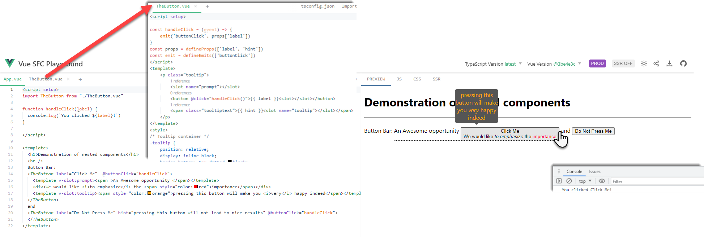

## Reactive

Now the fun really begins. Reactive frameworks like Vue provide built-in two-way bindings between variables and UI elements. When the variable changes, all dependent UI elements are automatically synchronized by the framework. This is a wonderful thing for frontend developers. Simply wonderful.

In the next two labs you will play around with these reactive mechanisms. You will see how to add reactiveness to a variable - by simply wrapping its definition in function `ref()`. That is all it takes. The use of functions *computed* and *watch* take it to the next level. You will see and enjoy!

### First simple steps with Reactive, Computed and Watch

Open a [fresh Vue Playground](https://play.vuejs.org/). 

It contains an example a reactive data element. Type a new message in the input field. You will notice that the heading changes fully synchronized with what you are typing. You

The heading `<h1>` contains the expression `{{msg}}` that refers to the reactive variable `const msg`. The use of `ref` has made this a reactive data element. This element also provide the foundation for the input field, through the attribute `v-model`. When the value in the input field changes, the variable is immediately synchronized and because of the change of the variable, the heading is also immediately updated.

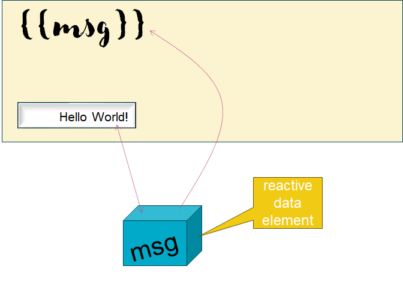

Let's add a computed, reactive property that is automatically updated with every change to the *msg* variable. 

Inside `script`, change the import (add *computed*) and add *const MSG* as follows:
```
import { ref, computed, watch } from 'vue';
const MSG = computed(() => msg.value.toUpperCase())
```
MSG is a reactive element that always provides the uppercase value of variable *msg*.

Add this element to the `template` - to display the value of MSG:
```
<h2>{{MSG}}</h2>
```
You will see a second heading in the page. With every change in the input field, you will see the second heading with the uppercase value.

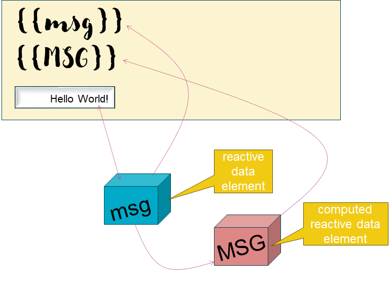

One other crucial element in the reactive mechanism is the *watcher*. We can register a function as an observer of a reactive variable. The function will be invoked whenever the value of the watched variable changes. 

In this case, register a function to react to a change in the *msg* variable. In this example, it will set the value of a another variable *somethingCompletelyDifferent*. Note: Unless we have special plans with this variable, we do not need the watch function - we could achieve the functionality shown here with just another computed property - or simply with an expression based on the *msg*.

Add an import of function *watch* - similar to *computed* and *ref* simply imported from *vue*. The then define a reactive variable and a watch function like this:

```
const somethingCompletelyDifferent = ref('')
watch(msg, async (newMsg, oldMsg) => {  
  somethingCompletelyDifferent.value= (newMsg === "help"? `URGENTLY HELP REQUESTED`:"")
  console.log(`value changed from ${oldMsg} to ${newMsg}`)
})
```
Add this expression in the `<template` - for example as the last child.

```
{{somethingCompletelyDifferent}}
```
Now when the value in the input field is equal to help, the message will be amplified. In the console you will find the old and new value - for every change observed by this watch function.
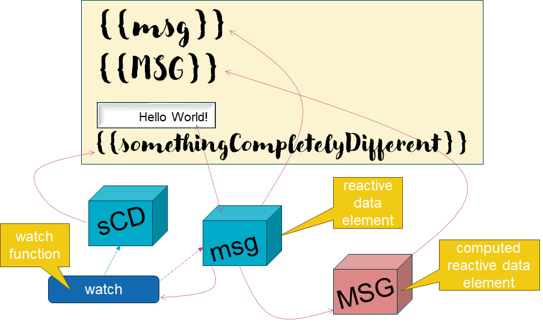

The full content of *App.vue* at this point is shown below. Deceptively simple - with a lot of moving pieces behind the scenes.

``` 
<script setup>
import { ref, computed, watch } from 'vue';

const msg = ref('Hello World!')
const MSG = computed(() => msg.value.toUpperCase())
const somethingCompletelyDifferent = ref('')
watch(msg, async (newMsg, oldMsg) => {  
  somethingCompletelyDifferent.value= (newMsg === "help"? `URGENTLY HELP REQUESTED`:"")
  console.log(`value changed from ${oldMsg} to ${newMsg}`)
})
</script>

<template>
  <h1>{{msg}}</h1>
  <h2>{{MSG}}</h2>
  <input v-model="msg">
  {{somethingCompletelyDifferent}}
</template>
```
This is what it looks like in the [Vue Playground](https://play.vuejs.org/#eNp9Uttu2zAM/RVOGBAHyFysfcviDFtrtBvarssFwwA9xLDpSydLhiQnKQz/+ygZzvbQ5sGwdMhDnkOqY1+aJty3yOZsYVJdNRYM2rZZclnVjdIWOtCYzyBVddNazGZwSGxaQg+5VjVMiDv5xCWXqZLGQm0KiBwjmNyhEAp+KS2yd5PpmPCwvqWEsVoQTCFaOla4T0SLoVXbpkF9nRgMpieSUTXaspLFNfEEWhQvN1Weo0Zpx3auhZcWULUZJOZFphBIPDy4qxIZ/X2zDoBLOFtzEBONdIiiCDgrUTScfYbddnUbP27uf8NdfP8Eq/jnNl5v4pvdnDPOSAaQP2mUwFCoItj5YpCWiSwwG8b2vhsE9WAVXYY2/Y64PX2Li2EVtAS6WCR9iUW6ASzKj8uuI4d9v7ig84BdEkaD9djlgFWSBgz7D7XKUEScEYUzH+q6c9b73vU/9WQzZg25yasifDZK0jvpXBHO3AorgfpHYytyy9kcfMTFEtr84bvHrG5xNuJpiemfV/Bnc3QYZ08aDeo9cnaK2UQXaIdwvH7EI51PQXLXCso+E1whbaJ1Goe0r63MSPZ/eV7tN//aaSYbEx8tSjOackJdZu/zOaMH78b2lvV/cq/CK8+jnbL+L0IOJuI=)
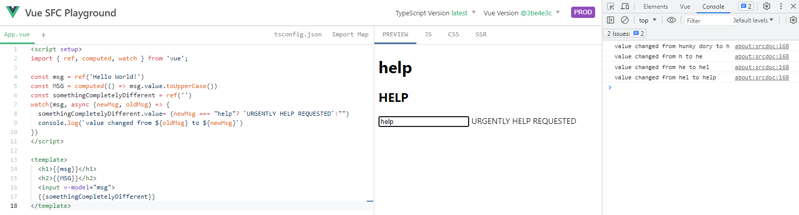
### Reactive Example - Clock Adjustment

Open a [fresh Vue Playground](https://play.vuejs.org/). Replace the content of the *App.vue* file with the following content:

```
<script setup>
  let myClock = new Date()
</script>

<template>
  Current time is {{myClock}}  
</template>
```

You will see the date time presented. It is static the time does not change once the page is loaded. Let's add a function that can adjust the clock. Add this snippet inside the `<script> tag.

```
function adjustClock() {
  myClock = new Date()
  console.log(`new clock setting ${myClock}`)
}
```
Let's also add a button to click and invoke this function. Add this snippet inside the template:
```
  <button @click="adjustClock()">Adjust Clock</button>
```
The button should now be shown. When you click it, the variable *myClock* is assigned a new value. If you look at the *Developer Tools | Console* you should see messages with the latest time. However, the time shown in the webpage does not change. Which is unfortunate.

Here is where the notion of *reactive* is going to help. We are going to turn *myClock* into a reactive variable. We have to do three things:

* import {ref} from 'vue' 
* define *myClock* as a reactive variable - by using `ref(new Date())` instead of just `new Date()` 
* modify function *adjustClock* to make it work correctly with *myClock* as reactive variable (by acting on myClock.value instead of just myClock)

To keep seeing the newly set time in the console, you also need to add `.value` to the `${myClock}` expression in `console.log`.

After making these changes, the component has this content :

```
<script setup>
import { ref } from 'vue'

function adjustClock() {
  myClock.value = new Date()
  console.log(`new clock setting ${myClock.value}`)
}

let myClock = ref(new Date())

</script>

<template>
  Current time is {{myClock}}
  <button @click="adjustClock()">Adjust Clock</button>
</template>
```
The template did not change - only a few small changes in the `script` section. Click on the button to update the time. And again. And again.

To turn this clock into a live clock that does not require a button to be clicked for constant adjustment, you could add the following snippet in the `script` section:

```
setInterval(adjustClock, 1000)
```

Every 1000 miliseconds, function *adjustClock* will be invoked and do its thing. Reactivity provides the magic that after the variable *myClock* is updated takes care of updating the web UI. 

Check the final application in this [playground project](https://play.vuejs.org/#eNp9UsFOwzAM/RUrQqJIUzfEDRUEDA5wAAQcc6Bk3siWJlXiwFDVf8dJtbFJaLfY79l+z3Enrtu2/IoozkUVlNctQUCK7aW0ummdJ+jA4xx6mHvXwDFTj6WVdh6tIu0s1LNlDDQ1Tq2KE+ikBWh+clh+1SYiXIDFb7itCYuThCpngzNYGrco3hOkEjlNJW0XcNTtlffvXNSniQZp05l7sqbiry9zpOUO95bQc12xo2oEp5PJJDOq8WCRzXFA2LSGyzkCmEbv0RKQbhB0gG4jo+fhANVHJGK3V8potbqQYs+2FJfXOYacqMYDmxtX4+0UMRIU2PxcL8plcJY3nrclhXJNqw36pzZtNEhxPuwxYbUx7vsh58hHHG3y6hPV6p/8MqxTTopnj4F3gVJsMar9AmmA714fcc3vLdi4WTTMPgC+IH9cTBoH2k20M5a9w8tq7/Pd8F++hbs1oQ0bU0loYvaZLwXf0vSA9T+5Z+VZruNLEP0vWpXrQQ==).

## Software Engineering

So far in this tutorial, we are able to try out the workings of Vue using a very simple environment: the Vue Playground. However, that is not where *real* applications are baked. In a full blown development environment, we will typically work in an IDE (frequently VS Code with the Volar extension for Vue development) and on a machine with Node, npm and a build tool installed (usually Vite). Thanks to the HMR (Hot Module Reload) capability of Vite, we can see changes we make in the sources immediately reflected in the browser running the application.

In addition to assembling a development environment locally on your laptop - which can easily be done - we can also make use of two special types of environments. One is StackBlitz, based on web container technology and running completely inside a browser. It may sound odd: there is a server (Node) running inside your browser. Yet that is really what it is. The other type of development environment I would like to mention is the ephemeral kind: a cloud based VM that run everything you need, without you having to install or maintain any of it. Examples are Gitpod.io and GitHub Codespaces.

We will take a look now at StackBlitz and Gitpod.io. Note: for the latter, you need a GitHub or GitLab account.

One thing you may also enjoy during Vue application development is the browser extension for Vue, available for the major browsers:
* [Chrome Extension](https://chrome.google.com/webstore/detail/vuejs-devtools/nhdogjmejiglipccpnnnanhbledajbpd)
* [Firefox Addon](https://addons.mozilla.org/en-US/firefox/addon/vue-js-devtools/)
* [Edge Extension](https://microsoftedge.microsoft.com/addons/detail/vuejs-devtools/olofadcdnkkjdfgjcmjaadnlehnnihnl)


### Vue Development with Stack Blitz

Open a clean Vue development environment in a browser by clicking on this link: [https://vite.new/vue](https://vite.new/vue).

Look closely at what happens in the browser. It looks like VS Code - on the left hand side are the file navigator and icons for various options. In the center of the screen is the file editor. And - after a little wait - you will see the running application on the right hand side. It took a while for the application to start running because first the necessary npm packages had to be installed.

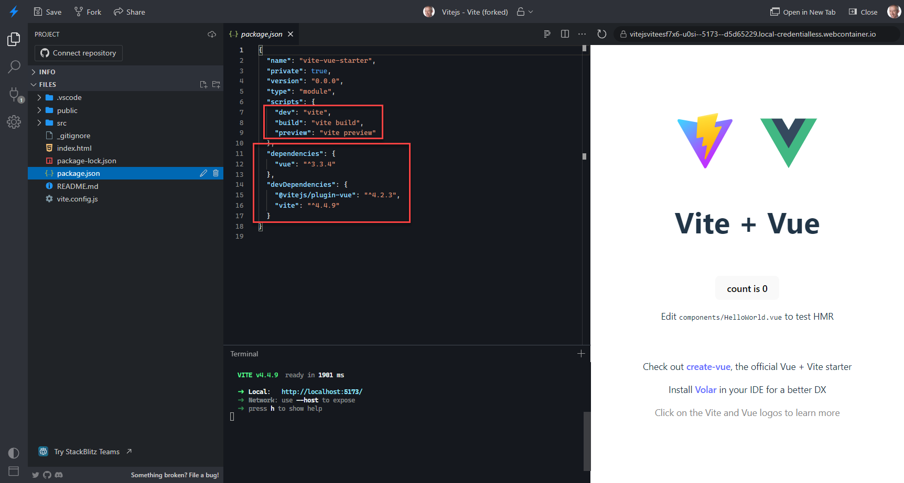

Open file *package.json*. It contains several areas of interest:
* dependencies and devDependencies - these list the npm packages that the application requires, either at run time or at develop & build time; when we add new dependencies to the application - as we will be doing shortly - new entries are added into this file
* scripts - various actions can be performed by our build tool - such as run the application for development purposes (with hot reload of modules) and build the application for deployment. These actions are executed through scripts that are defined here

Open file *App.vue*. Locate the component *HelloWorld* and change the value of the *msg* attribute to *"You, Vite + Vue"*. Or make some other change. You should see your modification reflected in the running app immediately.

In the bottom of the center pane is the terminal window. This is where currently the *dev* script is executed by *npm*. Click on that pane and press `ctrl+c` (or `cmd+c`) to stop the current terminal session. You can now perform execute Linux commands, including installation of npm packages. You can run the application again by executing the command `npm run dev`.

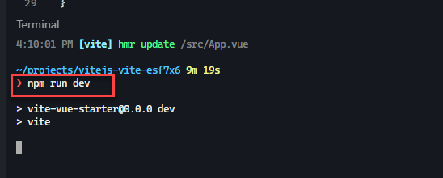

You can do several additional interesting things with StackBlitz:
* connect to GitHub and create a new repository from the current workspace or import an existing repository
* share a link to the StackBlitz workspace and allow other users to start working from the same set of source you have (but their clone of those sources - I think)
* download the project as a zip-file

Check out the [StackBlitz Documentation](https://developer.stackblitz.com/)


* StackBlitz
* Gitpod


## State (optional)


start new StackBlitz Vue application - https://vite.new/vue?terminal=dev 

open StackBlitz project at: 

https://stackblitz.com/edit/vitejs-vite-2epp3c?file=src%2FApp.vue&terminal=dev

Folder *src/stores* contains a file called *people.csv*. Using test data generator Mockaroo, I have generated 150 records of non existent people. I would like this file to provide some of the state for the application - at least until I can invoke a proper REST API to get my data.

We will use Pinia and create a simple state store to make the people data from this file available to components in the Vue application.

In terminal, execute this next line to add the dependency on the Pinia package to the project:
```
npm install pinia --save
```
This will install Pinia and add a dependency in *package.json*.

To initialize Pinia in a Vue application, you need to add two lines in *main.js*, and make that file look as is shown below:

```
import { createApp } from 'vue';
import './style.css';
import { createPinia } from 'pinia';  // ADD THIS LINE 
import App from './App.vue';

const app = createApp(App);
app.use(createPinia());  // ADD THIS LINE TOO
app.mount('#app');
```

Next, we have to create the file that defines the store. Create a new file, called peopleStore.js in the folder src/stores.

Copy this code to the new file
```
import { defineStore } from 'pinia';
import peopleRecords from './people.csv';

export const usePeopleStore = defineStore({
  id: 'people',
  state: () => ({
    people: peopleRecords,
  }),
  getters: {
    peopleCount: (state) => {
      return state.people.length;
    },
  },
  actions: {},
});
```

The data from the csv file is loaded into the local variable peopleRecords - an array of objects with the names of the fields in the first row of the CSV file (the headers) as the names of the properties.

The store object is defined with state containing a single property called *people*. The store also exposes a getter method that exposes the derived, computed value of the number of people on the state collection.

Using the peopleStore, we can now flesh out the App.vue file and display some real people information.

Edit file *App.vue* and paste in the contents shown below. This code imports the peopleStore through the usePeopleStore function. Using this function, the store is locally made available. In the template, both the *peopleCount* getter function and the *people* state property are accessed. The latter is used to iterate - producing a list item element for every person in the collection.

Note that *App.vue* does not contain any code for retrieving the CSV records from file or API. This component simply leverages the store and is shielded from how that data is retrieved and managed.

```
<script setup>
  import { usePeopleStore } from './stores/peopleStore';

  const peopleStore = usePeopleStore();
</script>

<template>
  <h1>{{ peopleStore.peopleCount }}People</h1>
  <ul>
    <li v-for="person in peopleStore.people">
      {{ person.first_name }} {{ person.last_name }} ({{ person.city }})
    </li>
  </ul>
</template>
```

## UI Libraries

There are many UI Component libraries for Vue. Libraries that you can easily include in your application and whose components can be used as easily as any custom component you create yourself. Many of these freely available components are visually appealing and functionally rich. These components allow us to tremendously speed up our productivity and produce far better results. Even for newbie Vue developers (or perhaps especially for newbie Vue developers?), these components can be a big boon.

Let's take a look at one of these libraries - PrimeVue. Explore the PrimeVue UI Components library at [https://primevue.org/](https://primevue.org/). Check out the [DataTable](https://primevue.org/datatable/).

We will be using this DataTable component to present the people data we discussed in the previous section in a more organized and as it turns out a quite powerful way. 

First we need to add the PrimeVue library to the application, using this command that is to be executed in the terminal:
```
npm install primevue --save
```

Then open file main.js and add the following lines - to import and subsequently initialize a number of PrimeVue resources:

```
import PrimeVue from 'primevue/config'; 
import "primevue/resources/themes/lara-light-blue/theme.css";
import Button from 'primevue/button';
import DataTable from 'primevue/datatable';
import Column from 'primevue/column';
import InputSwitch from 'primevue/inputswitch';
import InputText from 'primevue/inputtext';
import Dialog from 'primevue/dialog';
import Tag from 'primevue/tag';

app.use(PrimeVue);
app.component('Button', Button);
app.component('DataTable', DataTable);
app.component('Column', Column);
app.component('InputSwitch', InputSwitch);
app.component('InputText', InputText);
app.component('Dialog', Dialog);
app.component('Tag', Tag);
```

With the preparations in place, we can now leverage the DataTable for real. We do so in file App.vue. Modify the contents op App.vue by pasting the following code snippet into it.

```
<script setup>
  import { usePeopleStore } from './stores/peopleStore';
  const peopleStore = usePeopleStore();
</script>

<template>
  <h1>{{ peopleStore.peopleCount }} People</h1>
  <DataTable :value="peopleStore.people" tableStyle="min-width: 50rem">
    <Column field="first_name" header="First Name"> </Column>
    <Column field="last_name" header="Last Name"> </Column>
    <Column field="city" header="City"> </Column>
    <Column field="countryOfOrigin" header="Country"> </Column>
    <Column field="favoriteColor" header="Favorite Color"> </Column>
  </DataTable>
</template>
```
The DataTable component is linked to the data collection provided by in the peopleStore's people state element - the same one we used earlier in the unordered list produced by the *v-for* on the `<li>` element. Five columns are defined, each deriving its value from one of the properties in each person object in the people collection. The *field* attribute corresponds to the property name. The *header* attribute is used to set the label displayed on top of the column.

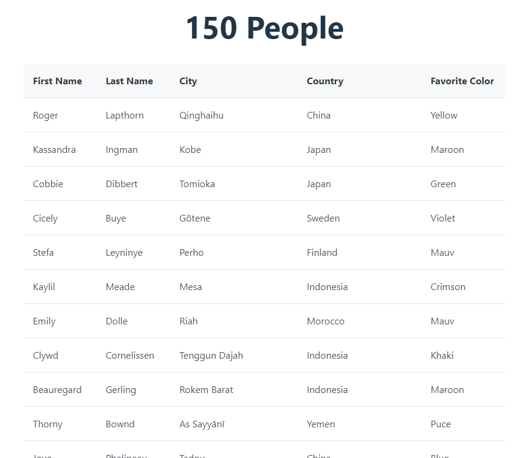

This is all it takes to present the 150 people records in a structured way in a Data Table. And you have seen just the beginning of what the DataTable can do for us.


Show the actual favorite color. Change the column definition for the favorite color column to:
```
    <Column field="favoriteColor" header="Favorite Color">
      <template #body="slotProps">
        <span
          class="flex align-items-center gap-2"
          :style="`background-color:${slotProps.data.favoriteColor}`"
        >
          {{ slotProps.data.favoriteColor }}
        </span>
      </template>
    </Column>
```

Here we use a body slot for the Column component through which we provide the content to be rendered inside the column cell. This content consists of the value for favorite color with a background color of exactly that color. 

To show off, let's do something really fancy. We add column drag & drop to the table. Add `reorderableColumns` to the DataTable tag, like so:
```
  <DataTable :value="peopleStore.people" tableStyle="min-width: 50rem" reorderableColumns>
```

Check the live web page and see how you can now drag columns around. Perhaps not the first thing you would go looking for, but impressive to inject by adding a single string inside the DataTable tag.  

More useful probably is the ability to sort the records - by first name, last name or any other column. We can add this functionality for each column by adding the string `sortable` to the column tag. For example:

```
 <Column field="first_name" header="First Name" sortable> </Column>
```

Please make all columns sortable by adding the string *sortable* to their definition.
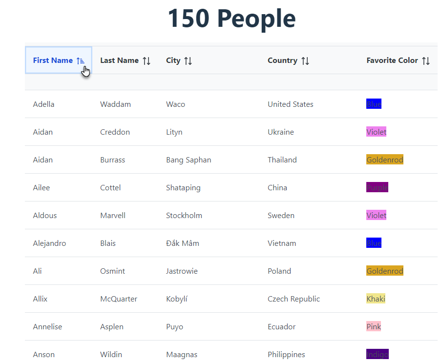

The Data Table offers a nice feature: a global search filter. The value typed into that filter is used by the DataTable to filter out all records that do not contain the value in one of the designated search fields.

In `<script>` make these changes - to import the required filter resources as well as the *reactive* mechanisms ref and computed. Then define the *filters* object as a reactive data element. The global filter is defined without a default value and with a filter mode of *contains*. Other options allow us to filter for example by exact match or start of the string.

```
  import { FilterMatchMode, FilterOperator } from "primevue/api";
  import { ref, computed } from 'vue'

  const filters = ref({
    global: { value: null, matchMode: FilterMatchMode.CONTAINS }
  })
```

Next, in order to make the DataTable show and apply the global filter, we need to define the filter in the `<DataTable>`. Add the following attributes - to associate the *filters* variable as the model for the filtering performed by the DataTable. Through globalFilterFields, indicate which fields should be used by DataTable to check if a record meets the filter criteria.

```
     v-model:filters="filters" :globalFilterFields="['first_name','last_name','city','countryOfOrigin']" filterDisplay="row"
```

Finally, as an additional child of `<DataTable>` add a template for the *header* slot that renders the field into which the user can type the value to be used for filtering. This field's model is associated with the *value* property in the *global* filter in the *filters* object - the same object associated with the *filter* attribute of the DataTable:
```
    <template #header>
      <div class="flex flex-wrap align-items-center justify-content-between gap-2"
      >
        <InputText v-model="filters['global'].value" placeholder="search for" />
      </div>
    </template>
```
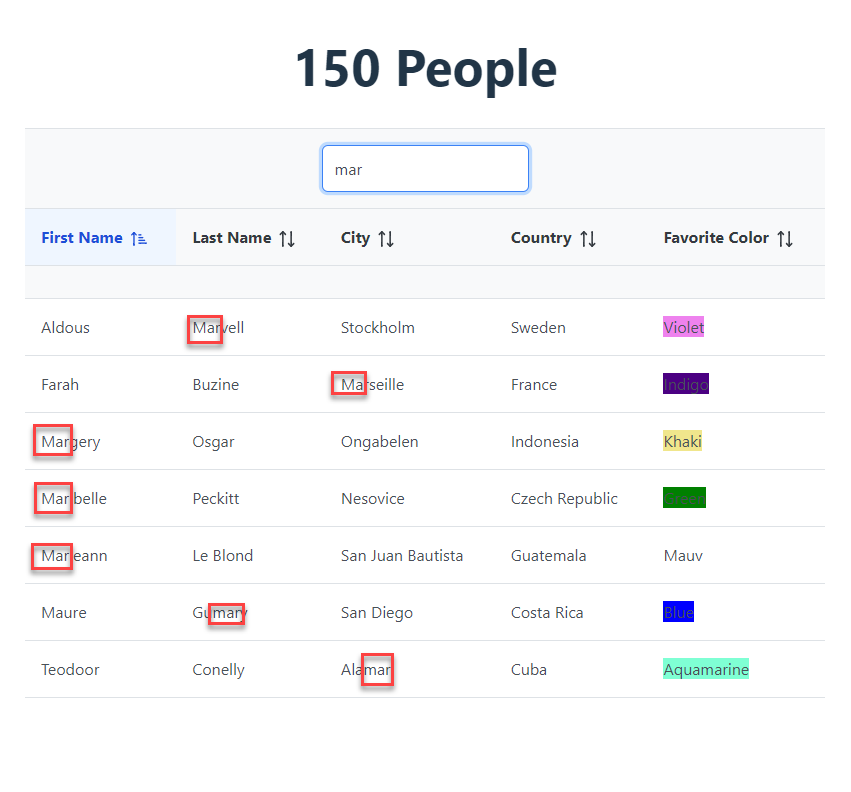

In addition to the global filter, the DataTable makes it also easily possible to define a filter on an individual coluumn. 

add:
filter
expand

https://stackblitz.com/edit/vitejs-vite-ccvueb?file=src%2FApp.vue

## i18n - internationalization